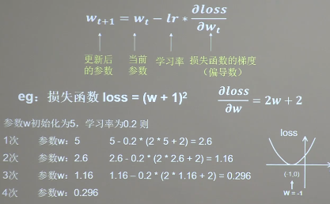

## 学习率



### 静态学习率
指训练过程中学习率一直保持不变

### 动态学习率(指数衰减学习率)
动态学习率指学习率的值会随着迭代次数的进行,将学习率不断调小,以达到前期快速找到较优解,后续防止震荡的情形
```
方法:
可以先使用较大学习率,快速得到较优解,然后逐步减少学习率,使模型在训练后期稳定
指数衰减学习率=初始学习率*学习率衰减率^(当前轮数/多少论衰减一次)
demo见:01-lr.py
```

