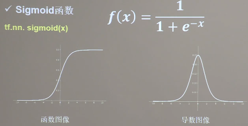
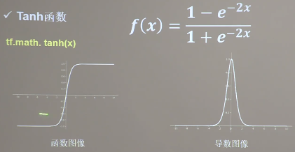
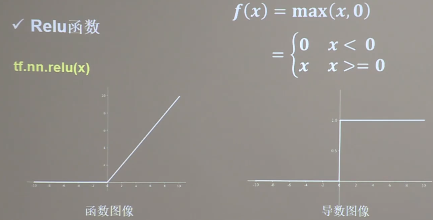
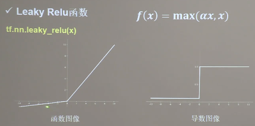
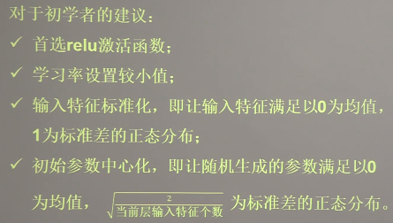

## #激活函数 

### sigmoid函数


tf.nn.sigmoid(x),  f(x) = 1/(1+e^(-x))
```
特点:
1)容易造成梯度消失
2)输出非0均值,收敛慢;
3)幂运算复杂,训练时间长
```

### Tanh函数

tf.math.tach(x), f(x) = (1-e^(-2x))/(1+e^(-2x))
```
特点: 
1)输出是0均值;
2)已造成梯度消失;
3)幂运算复杂,训练时间长
```

### Relu函数

tf.nn.relu(x), f(x) = max(x, 0)
```
优点: 
1) 解决了梯度消失问题(在正区间);
2)只需判断输入是否大于0, 计算速度快;
3)收敛速度远快于sigmoid和tanh

缺点: 
1) 输入非0均值,收敛慢;
2) Dead relu问题,某给神经元可能永远无法激活,导致相应的参数永远不会被更新.造成神经元死亡.
```
 
### Leaky Relu函数

tf.nn.leaky_relu(x), f(x) = max(ax, x)
```
特点: 
    理论上来讲,Leaky_relu有relu的所有优点,外加不会有dead relu问题,但在实际操作当中,并没有完全证明Leaky_relu总是好于relu
```

### 对于初学者建议

