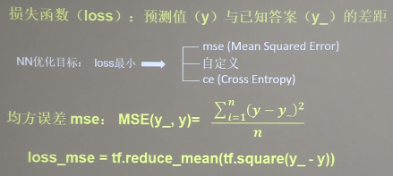

## 损失函数(loss)



### mse损失函数


demo见: 01-mse.py

### 自定义损失函数
demo见: 02-self_define.py


### 交叉熵损失函数(ce)

```
# 交叉熵损失函数CE(cross entropy)
import tensorflow as tf

res = tf.losses.categorical_crossentropy([1, 0], [0.6, 0.4])
print(res)
res = tf.losses.categorical_crossentropy([1, 0], [0.8, 0.2])
print(res)
```

### softmax+ce损失函数

```
# 分开计算
y_prob = tf.nn.softmax(y_pre)
print(y_prob)
res = tf.losses.categorical_crossentropy(y, y_prob)
print('分开计算结果\n', res)

# 直接调用函数
res = tf.nn.softmax_cross_entropy_with_logits(y, y_pre)
print('直接计算结果\n', res)
```
demo见: 02-softmax_ce.py
