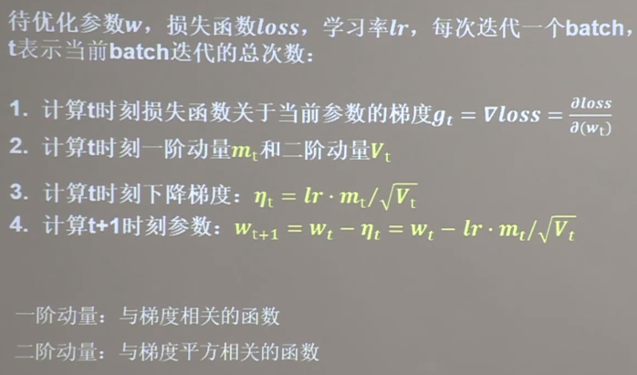
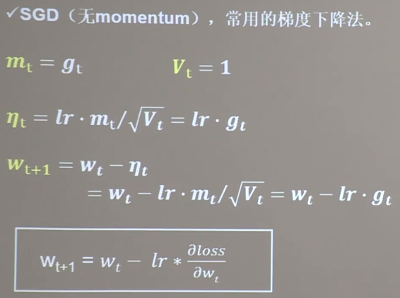
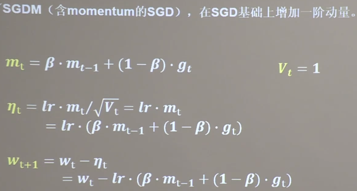
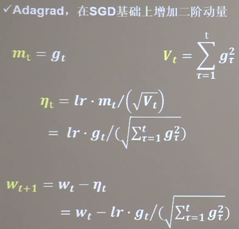
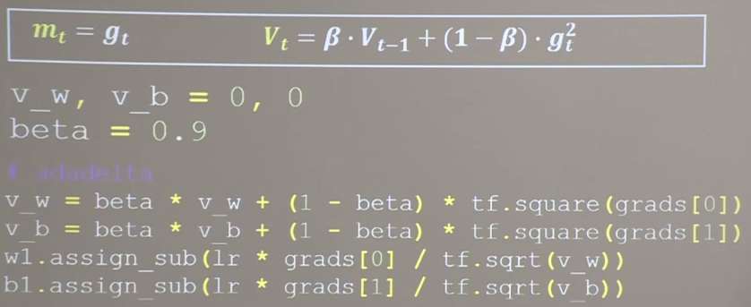
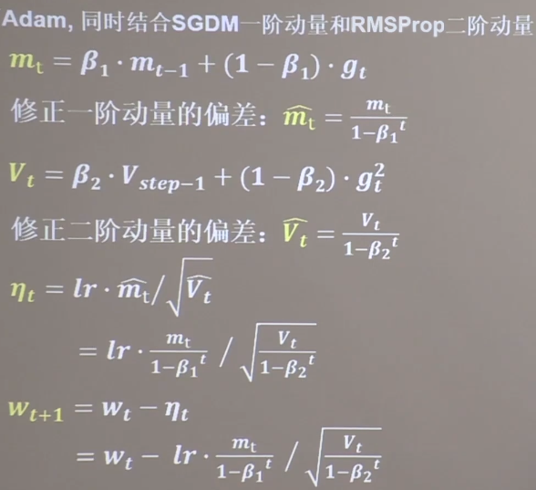
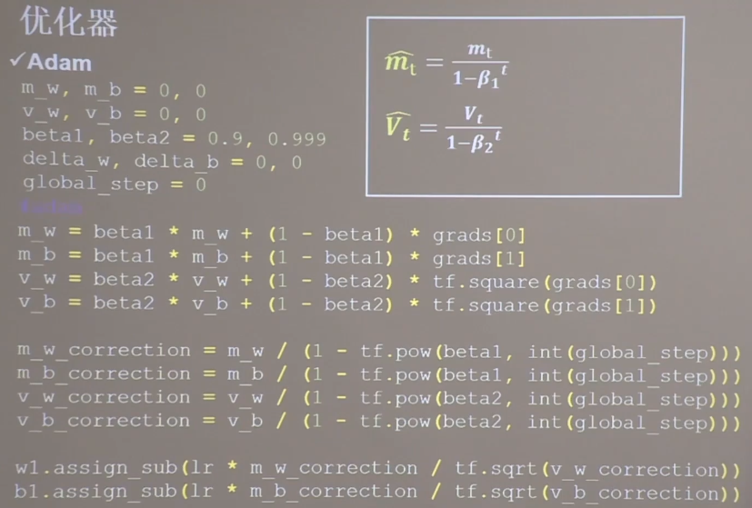

## 优化器



### 1. SGD(无momentum), 常用的梯度下降法

```
w1.assign_sub(lr * grad[0])
b1.assign_sub(lr * grad[1])
```

### 2.SGDM



### 3.Adagrad， 在sgd基础上增加二阶动量



### 4.RMSProp优化器


### 5.Adam, 同时结合SGDM一阶动量和RMSProp二阶动量


### 优化器训练时间对比

sgd: 6.829
sgdm: 9.661
adagrad: 7.80