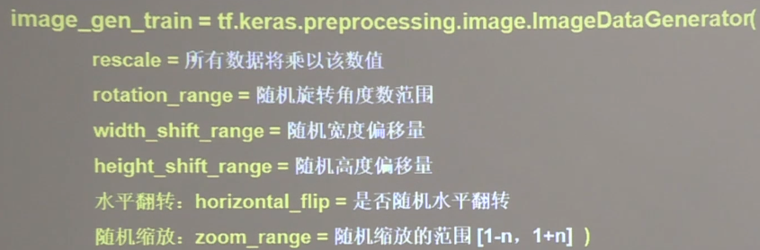

## 数据增强



```buildoutcfg

imgae_gen_train = ImageDataGenerator(
    rescale=1.,  # 所有值都将乘以该值， 如为图像，可设置为1.0/255时， 可归至0-1
    rotation_range=45,  # 随机45度旋转
    width_shift_range=0.15,  # 宽度偏移
    height_shift_range=0.15，  # 高度偏移
    horiziontal_flip=False,  # 水平翻转
    zoom_range=0.5  # 将图像随机缩放50%
    )
image_gen_train.fit(train_x)

```