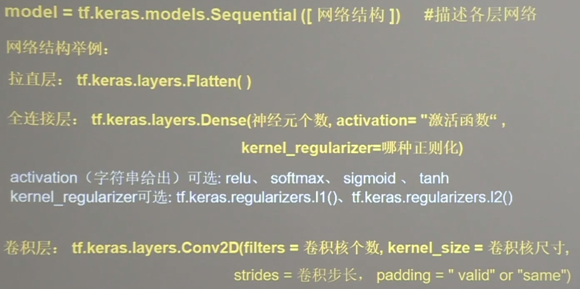

## 使用tensorflow API: tf.keras搭建网络

### 1. 网络搭建六步法
- import
- train, test
- model = tf.keras.models.Sequential
- model.compile
- model.fit
- model.summary

### 2. 网络层描述


### 3. compile
model.compile(optimizer=优化器， loss=损失函数, metrics=[’评价指标‘])

optimizer：
- 'sgd', tf.keras.optimizers.SGD(le=学习率，momentum=动量参数)
- 'adagrad' tf.keras.optimizers.SGD(le=学习率)
- 'adadelta'tf.keras.optimizers.SGD(le=学习率)
- 'adam' tf.keras.optimizers.SGD(le=学习率，beta_1=0.9, beta_2=0.999)

loss:
- 'mse', tf.keras.losses.MeanSquaredError()
- 'sparse_categrical_crossentroy' tf.keras.losses.SparseCategoricalCrossentropy(from_logits=false)
from_logits, 但使用了softmax， 则设置为false，否则设置为true
  
metrics:
- 'accuracy', y_和y都是数值， 如y_=[1, 2, 3], y=[2, 1, 3]
- 'categorical_accuracy' y_和y都是热编码（概率分布）， 如y_=[0, 1, 0], y=[0.3, 0.6, 0.1]
- sparse_categorical_accuracy', y_是数值，y是热编码(概率分布)， y_=[1], y=[0.3, 0.6, 0.1]

### model.fit
model.fit(训练集的输入特征，训练集的标签， batch_size=, epochs=, validation_data=(测试集的输入特征，测试集的标签)，
          validation_split=从训练集中划分多少比例给测试集，validation_freq=多少次epoch跑一个验证集)      

### model.summary
输出网络模型结构


### 自定义带有跳连的非顺序结构模型
```
class MyModel(Model):
    def __init__(self):
        super(MyModel, self).__init__()
        # 定义网络结构模型
    
    def call(self, x)
        # 调用网络结构块， 实现前向传播
        return y

model = MyModel()
```