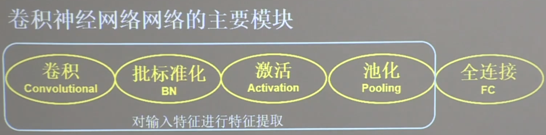

## 卷积神经网络

- 卷积就是特征提取器
- 借助卷积核提取特征后，送入全连接网络

卷进神经网络的主要模块

几个模块简称CBAPDF（卷积，标准化，激活函数，池化，舍弃，全连接）

```buildoutcfg

import tensorflow as tf
from tensorflow.keras.layers import Dense, MaxPool2D, Flatten, Conv2D, BatchNormalization, Activation, Dropout

model = tf.keras.models.Sequential([
  Conv2D(filters=6, kernel_size=(5, 5), padding='same'),
  BatchNormalization(),  # 添加BN层
  Activation('relu'),
  MaxPool2D(pool_size=(2, 2), strides=2),
  Dropout(0.0),
  Flatten(),
  Dense(10, activation='sigmoid')
])

```