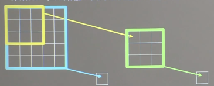
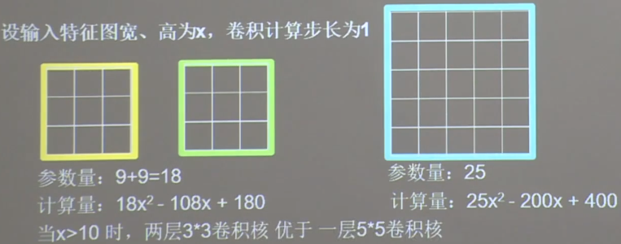

## 感受野(receptive field)

- 卷积神经网络个输出特征图的每个像素点， 在原始输入图片上映射区域的大小


下面两个3 *3得到一个点及5 *5得到一个点，其感受野都是5（得到一个点与原始图片上哪些区域相关）。两个3 *3的和一个5 *5感受野得到的结果是一样的，



假设输入特征图宽和高为x，卷积步长为1， 其计算量如下：

但x > 10时，两层3 *3的卷积核优于5 *5的卷积核

```buildoutcfg
3 *3计算
卷积核为3，每计算一个输出点，需要的计算量为9， 第一个3 *3卷积后，得到的图片宽高为x-2， 共（x-2）^2个点,  共计算量为 9 *(x-2)^2
第二个3 *3卷积后，得到的图片宽高为x - 2 - 2, 共（x-2-2）^2个点，共计算量为：9 *（x-2-2）^2
总计算量为： 9 *(x-2)^2 + 9 *（x-2-2）^2 = 18x^2 - 108x + 180

5 *5计算
卷积核为5， 每计算一个输出点，需要的计算量为5 *5， 卷积之后得到的图片宽高为x - 4， 计算量为： 25*（x-4）^2=25x^2 -200x = 400
```
