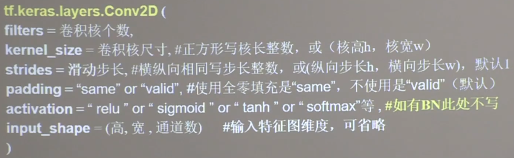

## tf卷积层介绍



tf.keras定义方式：
```buildoutcfg
import tensorflow as tf
from tensorflow.keras.layers import Dense, MaxPool2D, Flatten, Conv2D

model = tf.keras.models.Sequential(
    [Conv2D(6, kernel_size=5, strides=1, padding='valid', activation='relu'),
     MaxPool2D(2, 2),
     Conv2D(6, kernel_size=(5, 5), strides=(1, 1), padding='valid', activation='relu'),
     MaxPool2D(pool_size=2, strides=(2, 2)),
     Conv2D(filters=6, kernel_size=(5, 5), padding='valid', activation='sigmoid'),
     MaxPool2D(pool_size=(2, 2), strides=2),
     Flatten(),
     Dense(10, activation='sigmoid')
     ]
)
# 建议使用带参数名的方式，这样会使代码可读性更强
```