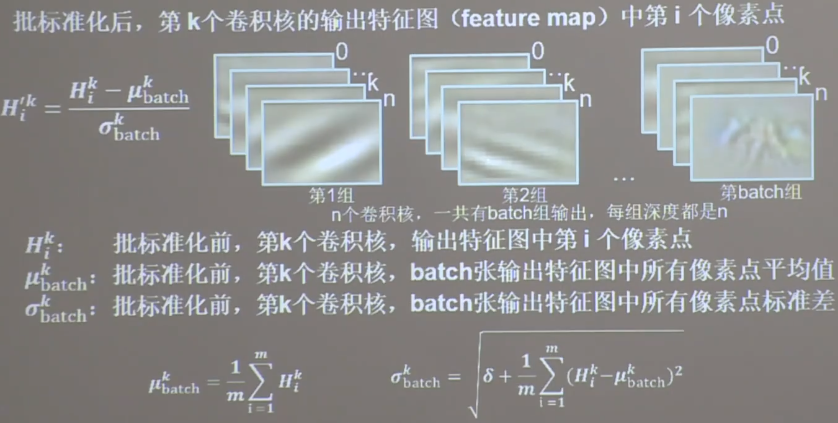
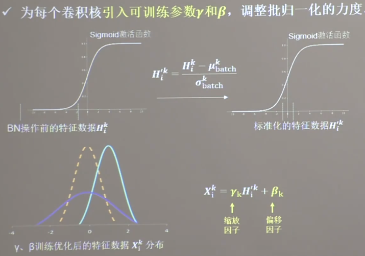

## 标准化（batch normalization, BN）

标准化：时数据符合均值为0， 标准差为1的分布
批标准化： 对一小批数据(batch)做标准化处理




通过BN操作，将数据调整到0附近，在0的附近，其梯度更为明显，更利于收敛。
但使用sigmoid函数时，在0附近，近似线性， 使激活函数丧失了非线性特性，因此引入可训练参数gama核beta进行调整。是数据不完全服从标准正太分布。


BN层位于卷积层之后，激活层之前


```buildoutcfg
# tf.keras使用例子
import tensorflow as tf
from tensorflow.keras.layers import Dense, MaxPool2D, Flatten, Conv2D, BatchNormalization, Activation

model = tf.keras.models.Sequential([
  Conv2D(filters=6, kernel_size=(5, 5), padding='same'),
  BatchNormalization(),  # 添加BN层
  Activation('relu'),
  MaxPool2D(pool_size=(2, 2), strides=2),
  Flatten(),
  Dense(10, activation='sigmoid')
])

```