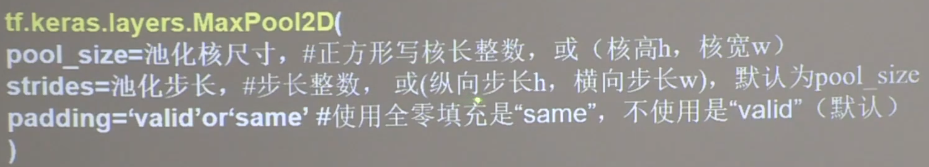

## 池化操作

- 池化用于较少特征数据量
- 最大池化可提取图片问题，均值池化可保留背景特征


最大池化


均值池化：


```buildoutcfg
# 代码demo
import tensorflow as tf
from tensorflow.keras.layers import Dense, MaxPool2D, Flatten, Conv2D, AveragePooling2D

model = tf.keras.models.Sequential([
    Conv2D(filters=32, kernel_size=(5, 5), padding='same', activation='relu'),
    MaxPool2D(pool_size=(2, 2), strides=2, padding='same'),  # 最大池化层
    Conv2D(filters=16, kernel_size=(5, 5), padding='same', activation='relu'),
    AveragePooling2D(pool_size=(2, 2), strides=2, padding='same'),  # 均值池化层
    Flatten(),
    Dense(10, activation='sigmoid')
])

```