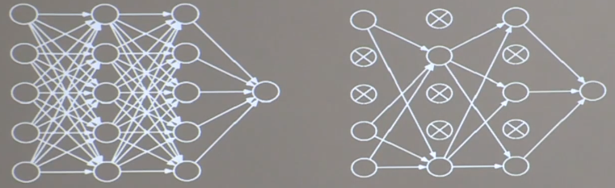

## 舍弃

- 在神经网络训练时，将一部分神经元按照一定的概率从神经网络中暂时舍弃。神经网络使用时，被舍弃的神经元回复链接



```buildoutcfg
# tf.keras使用

import tensorflow as tf
from tensorflow.keras.layers import Dense, MaxPool2D, Dropout, Conv2D, AveragePooling2D

model = tf.keras.models.Sequential([
    Conv2D(filters=32, kernel_size=(5, 5), padding='same', activation='relu'),
    MaxPool2D(pool_size=(2, 2), strides=2, padding='same'),
    Conv2D(filters=16, kernel_size=(5, 5), padding='same', activation='relu'),
    AveragePooling2D(pool_size=(2, 2), strides=2, padding='same'),
    Dropout(0.2),  # 舍弃20%的神经元
    Dense(10, activation='sigmoid')
])

```